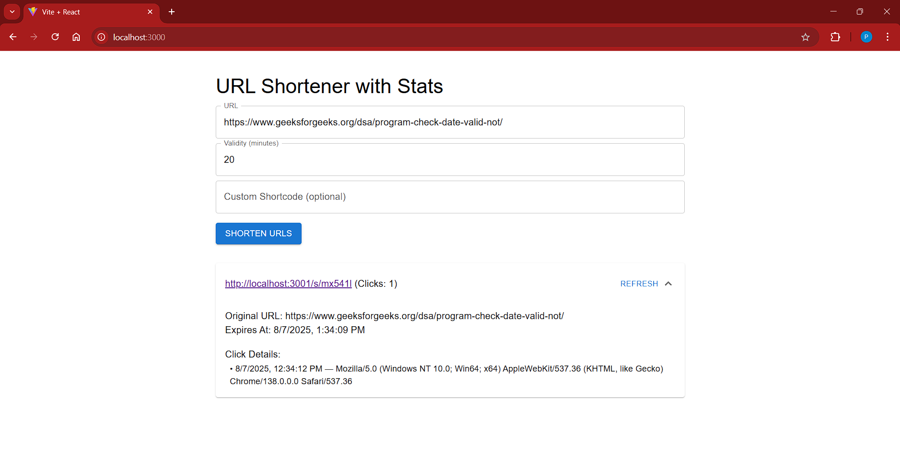

#  URL Shortner with Stats (and Screenshott)

This project is a simple URL shortner which also tracks how many times each link is clicked, and some stats like what browser the user had when clicked it.

##  Features

- Shorten long ugly links  
- Custom shortcode if you want  
- Check how many people clicked  
- Shows when it will expire  
- Shows what user agent was used in each click  

##  Technologies

- React + Material UI for frontend  
- Express backend (simple to run)  

##  How to Run
Clone the repo  
Run npm install on both frontend and backend folders  
Start backend server first node index.js  
Then npm run dev in frontend folder  
Use the form to paste any long URL and click shorten  

##  Screenshot

You can see the accordion shows how many clicks happend and when. The stats are auto fetched when you submit the shorten form.

##  Known Issues
- this issue is not from my side but from the server
localhost/:1 Access to fetch at 'http://20.244.56.144/evaluation-service/logs' from origin 'http://localhost:3000' has been blocked by CORS policy: The 'Access-Control-Allow-Origin' header contains multiple values '*, http://localhost:3000', but only one is allowed. Have the server send the header with a valid value.

